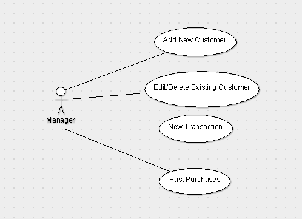

# Use Case Model

**Team 10**

## 1 Use Case Diagram

## 2 Use Case Descriptions

**Add Customer**
-----------------
This will allow the manager to add a new customer to the system. In order to add customers the  
system will need to be run on an Android device. Once this use case is complete, the customer  
must be input into the system and saved into the database for future access, then the system  
will revert to the initial screen.

**Scenario**
- Manager opens system and selects "Add new customer"
- Manger enters required information (first and last name, zip code, and email address)
- System also has spot for optional discount amount that can be set by the manager
- Manager selects "Add"

**Edit/Delete Existing Customer**
---------------------------------
This will allow the manager to edit an existing customer in the database. In order to edit or delete  
a customer there must be at least one customer already in the system. If this condition is not met the  
customers list will show as empty. Once the use case is run, the existing customer must either be 
deleted from the system or have the old information replaced with the new. Also, after running the  
use case, the system will revert to the initial screen.

**Scenario**
- Manager opens system and selects "Edit existing customer"
- Manager selects customer from list of existing customers
- Manager selects "Edit" or "Delete"
- if Edit:
	- Manager sees same editable screen as Add New Customer screen, but with all existing information filled in
	- Manager makes needed edits
	- Manager selects "Save"
- if Delete:
	- Customer is permanently deleted from database along with all rewards and discounts

**New Transaction**
-------------------
This will allow the manager to make a new transaction using the customer's credit card. To do this  
the customer must be present with the credit card and the credit card reader must be attached to  
the device. Once New Transaction is complete, the transaction must be stored in the customer's  
transaction list, the transaction must be processed through the payment-processing service, and  
the system must revert to the initial screen.

**Scenario**
- Manager opens system and selects "New Transaction"
- Manager enters required information (item name, item price, customer)
- If new customer, pertinent information must be manually filled in (first and last name, zip code)
- When customer is selected or entered, a textbox appears to use any discounts available
- When customer is selected, a star appears next to the name if the customer is a gold member
- Manager enters discount amount up to the max amount (shown next to textbox)
- Manager selects "Process" and is prompted to use card scanner to read the card
- After the card is read, the system automatically processes the transaction

**Past Purchases**
------------------
This will let the manager access all past purchases of a customer. In order to so this the customer  
must be an existing customer in the database. Once complete, all past purchases will remain as they  
were without alteration or deletion and the system will revert to the initial screen.

**Scenario**
- Manager selects "Past Purchases"
- System prompts manager to select an existing customer
- Manager selects "Select" which brings up a list of all past purchases of that customer
- Manager selects "Home" when finished and system reverts to the initial screen
