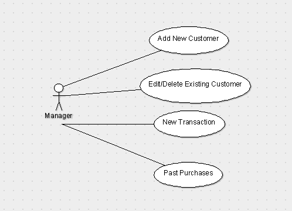

# Use Case Model

*This is the template for your use case model. The parts in italics are concise explanations of what should go in the corresponding sections and should not appear in the final document.*

**Author**: \<person or team name\>

## 1 Use Case Diagram

*This section should contain a use case diagram with all the actors and use cases for the system, suitably connected.*

## 2 Use Case Descriptions

*For each use case in the use case diagram, this section should contain a description, with the following elements:*

- *Requirements: High-level description of what the use case must allow the user to do.*
- *Pre-conditions: Conditions that must be true before the use case is run.*
- *Post-conditions Conditions that must be true once the use case is run.*
- *Scenarios: Sequence of events that characterize the use case. This part may include multiple scenarios, for normal, alternate, and exceptional event sequences. These scenarios may be expressed as a list of steps in natural language or as sequence diagrams.*

Add Customers
Manager opens system and selects "Add new customer"
Manger enters required information (first and last name, zip code, and email address)
Manager selects "Add"

Edit Customers
Manager opens system and selects "Edit existing customer"l
Manager selects customer from list of existing customers
Manager selects "Edit"
Manager sees same editable screen as Add New Customer screen, but with all existing information filled in
Manager makes needed edits
Manager selects "Save"

New Transaction
Manager opens system and selects "New Transaction"
Manager enters required information (item name, item price, customer)
When customer is selected, a dropdown appears to use any discounts available
When customer is selected, a star appears next to the name if the customer is a gold member
Manager enters discount amount up to the max amount (shown next to textbox)
Manager selects "Process" and is promped to use card scanner to read the card
After the card is read, the system automatically processes the transaction

Past Purchases
Manager selects "Past Purchases"
System prompts manager to select an existing customer
Manager selects "Select" which brings up a list of all past purchases of that customer

