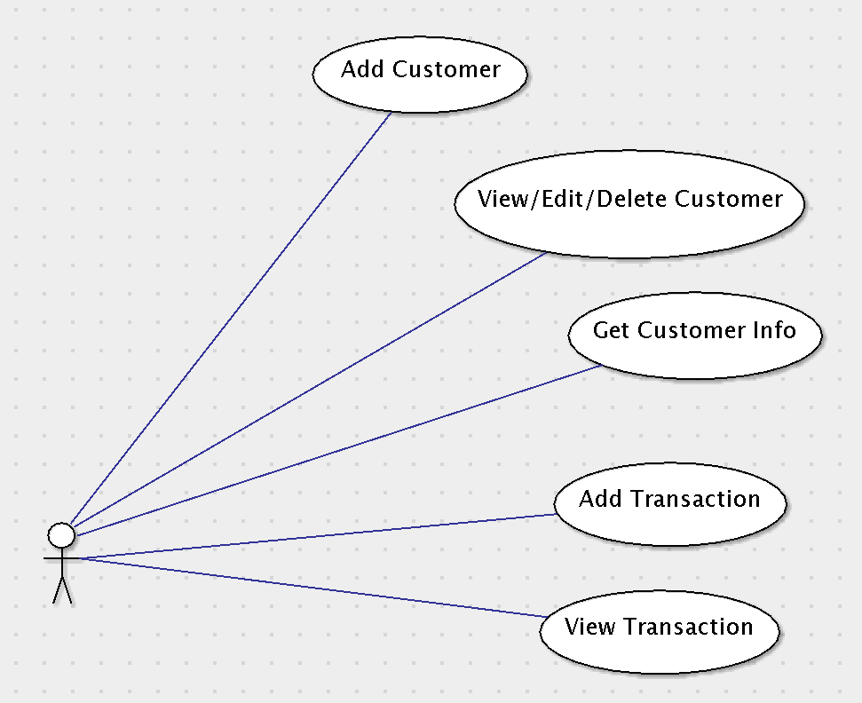

# Use Case Model

**Team 10**

## 1 Use Case Diagram

## 2 Use Case Descriptions

**Add Customer**
-----------------
This will allow the manager to add a new customer to the system. In order to add customers the  
system will need to be run on an Android device. Once this use case is complete, the customer  
must be input into the system and saved into the database for future access, then the system  
will revert to the initial screen.

**Scenario**
- Manager opens system and selects "Add Customer"
- Manger enters required information (first and last name, zip code, and email address)
- System also has spot to add custom Customer ID or default will add one 
- Manager selects “Submit”

**View/Edit/Delete Customer**
---------------------------------
This will allow the manager to edit an existing customer in the database. In order to edit or delete  
a customer there must be at least one customer already in the system. If this condition is not met the  
customers list will show as empty. Once the use case is run, the existing customer must either be  
deleted from the system or have the old information replaced with the new. Also, after running the  
use case, the system will revert to the initial screen.

**Scenario**
- Manager opens system and selects “View/Edit/Delete Customer"
- Manager selects customer from list of existing customers
- Manager has option of typing in last name of customer at top of screen to find customer
- Manager selects customer and then selects ”Edit" or "Delete"
- If Edit:
	- Manager sees same editable screen as Add New Customer screen, but with all existing information filled in
	- Manager makes needed edits
	- Manager selects “Submit” or “Return” to go back with out making changes
- If Delete:
	- Customer is permanently deleted from database along with all rewards and discounts. Manager is then prompted “Do you really want to delete customer?”. Manager then selects “Keep” or “Delete”

**Get Customer Info**
---------------------------------
This will allow the manager to pull up a customer and view their personal information along with their Status as gold member. It will also show their level of discounts and and total amount spent.

**Scenario**
- Manager opens system and selects “Get Customer Info"
- Manager enters customer ID and clicks “Submit”
- The system then loads the customer’s data 

**Add Transaction**
-------------------
This will allow the manager to make a new transaction using the customer's credit card. To do this  
the customer must be present with the credit card and the credit card reader must be attached to  
the device. Once Add Transaction is complete, the transaction must be stored in the customer's  
transaction list, the transaction must be processed through the payment-processing service, and  
the system must revert to the initial screen.

**Scenario**
- Manager opens system and selects “Add Transaction"
- Manager selects customer from list and clicks “Select” 
- Manager has option to filter list of customers by typing in last name of customer at top of screen 
- Manager then enters amount of transaction and reward status will show below “Amount” field
- If new customer, manager must add customer before entering transaction
- When customer is selected or entered, a text box appears to use any discounts available
- Manager selects “Submit” and is prompted to use card scanner to read the card
- After the card is read, the system automatically processes the transaction

**View Transactions**
------------------
This will let the manager access all past purchases of a customer. In order to so this the customer  
must be an existing customer in the database. Once complete, all past purchases will remain as they  
were without alteration or deletion and the system will revert to the initial screen.

**Scenario**
- Manager selects “View Transactions”
- System prompts manager to select an existing customer from list and has option to filter list by adding last name of customer at top
- Manager selects "Select" which brings up a list of all past purchases of that customer
- Manager selects "Home" when finished and system reverts to the initial screen
